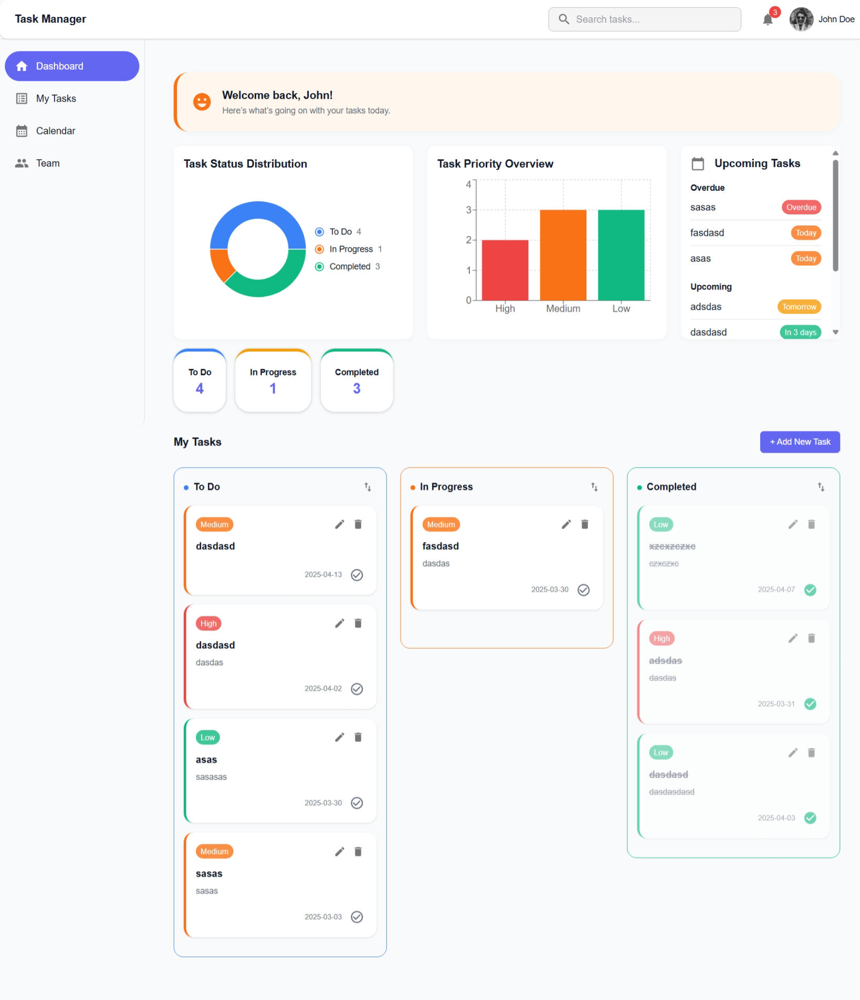

# 🧠 TaskFlow – Modern Task Management App

**TaskFlow** is a responsive, drag-and-drop task management system built using **React**, **Redux Toolkit**, **Material UI**, and **@hello-pangea/dnd**. It allows users to manage tasks across different statuses with filtering, sorting, analytics, and a sleek UI.

---

## 🚀 Features

### ✅ Task Management
- Create, edit, delete, and reorder tasks
- Task properties: title, description, priority, due date, assignees
- Task completion toggle
- Grouped into: **To Do**, **In Progress**, **Completed**

### 🧲 Drag and Drop
- Reorder tasks within a column
- Move tasks between status columns with drag-and-drop
- Reorders persisted using `order` property

### 🔍 Filtering & Sorting
- Per-column filters:
  - **Priority** (High, Medium, Low)
  - **Due Date** (Today, This Week, This Month)
  - **Sort by** (Date, Title, Priority)
- Filters are applied only when **Apply** is clicked
- Filters reset when a task is dropped into a new column

### 📊 Dashboard Analytics
- Task Status Distribution (Pie Chart)
- Task Priority Overview (Bar Chart)
- Summary Cards (Counts of To Do, In Progress, Completed)
- Upcoming and Overdue task cards

### 🧠 Smart Enhancements
- Responsive layout using Material UI Grid
- Theme-based colors using custom MUI theme
- Task order saved in `localStorage`
- Clean and consistent UI based on your custom palette

---

## 🛠️ Tech Stack

| Technology           | Usage                        |
|----------------------|------------------------------|
| **React**            | Core frontend framework      |
| **Redux Toolkit**    | State management             |
| **@mui/material**    | UI components (Material UI)  |
| **@hello-pangea/dnd**| Drag-and-drop support        |
| **date-fns**         | Date manipulation            |
| **localStorage**     | Task persistence             |

---

## 📁 Folder Structure

```
src/
│
├── components/               # Reusable UI components
│   ├── TaskCard.jsx
│   ├── TaskColumn.jsx
│   ├── TaskCharts.jsx
│   ├── AddTaskDialog.jsx
│   ├── FilterTaskDialog.jsx
│   ├── GroupedTaskBoard.jsx
│   ├── UpcomingTasks.jsx
│   ├── Header.jsx
│   └── Sidebar.jsx
│
├── features/
│   └── tasks/
│       └── taskSlice.js      # Redux logic for task operations
│
├── utils/
│   └── taskFilters.js        # Filtering and sorting logic
│
├── theme.js                  # Custom MUI theme
├── App.jsx                   # App wrapper
└── index.js                  # Entry point
```

---

## ⚙️ Local Setup

### 1. Clone the repo

```bash
git clone https://github.com/your-username/taskflow.git
cd taskflow
```

### 2. Install dependencies

```bash
npm install
```

### 3. Start the development server

```bash
npm run dev
```

Open [http://localhost:3000](http://localhost:3000) to view it in the browser.

---

## 🖌️ Customization

### Theme
Modify the `src/theme.js` file to update the color palette, fonts, border radius, etc.

```js
const theme = createTheme({
  palette: {
    primary: { main: '#6366F1' }, // Indigo
    ...
  },
  typography: {
    fontFamily: 'Inter, sans-serif',
    ...
  },
  shape: {
    borderRadius: 8,
  }
});
```

---

## 💡 Future Improvements

- Add user authentication
- Backend sync with database
- Tag and label support
- Calendar view & reminders
- Dark mode support
- Mobile-first optimizations

---

## 📸 Demo




---

## 🧑‍💻 Author

Made with 💙 by [Manish Singh](https://github.com/MAnishSingh13275)  
Connect on [LinkedIn](https://www.linkedin.com/in/singh-manish1/) | Visit [Portfolio](https://www.manishsingh.me/) | Visit [Gurukool.tech](https://gurukool.tech/)